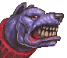
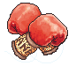
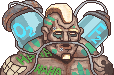
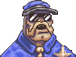
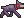
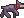
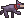
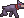

# Cidade dos Anjos 
      
Hi, my name is Rafael. This is a personal project inspired by a comic book I'm writing and illustrating. I plan to release it someday. The inspiration for this project came from the fascinating game Cookie Clicker 🍪, created by Orteil.

At the age of 10, I was captivated by its mechanics and artwork, and I found myself thinking, what if I created my own "Cookie Clicker".

Due to unexpected circumstances, I ended up becoming a computer science student at 18 and now at 20 I wanted to challenge myself to make that old idea come true. Obviously, I don't intend to simply copy Orteil's work with a new look.

## How to Run the Project
   
   
   
 
As it's a project made only with pure Javascript, HTML, and CSS, simply clone the repository and run the index.html file.

**I'm making the project available for people to see the development process and understand the code's functioning and logic behind it. However, it's worth noting that anyone with basic programming skills can easily obtain the source code through web scraping if the site goes live.**

**Also, I would greatly appreciate feedback on the project, and it would be great if you could leave some stars here on GitHub!**

## Project Ideas

 - [x] Implement city map navigation
 - [x] Implement interactions with city structures
 - [ ] Implement follower mechanic for your gang
 - [x] Modify the UI/UX of the main page, mainly fixing the Save and Import buttons
 - [ ] Optimize the code and include more observers, strengthen the use of object-oriented programming
 - [ ] Implement encryption in the game save

# Thanks to everyone who liked the project! If you could leave your star and follow the project, it would be great!

