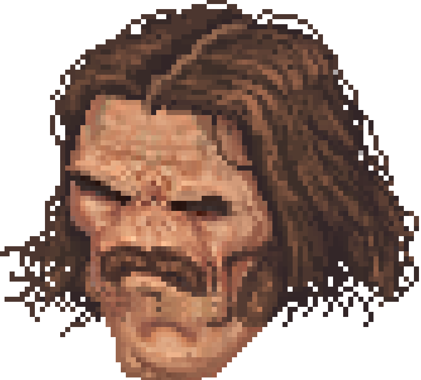
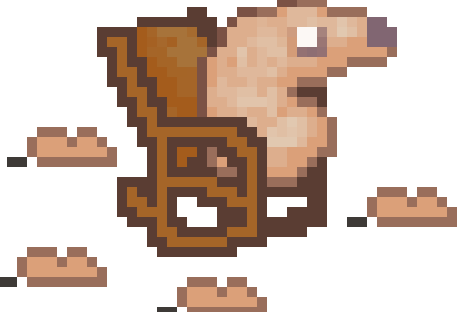
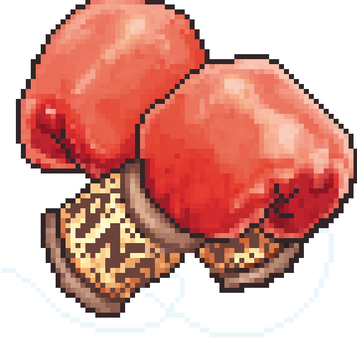
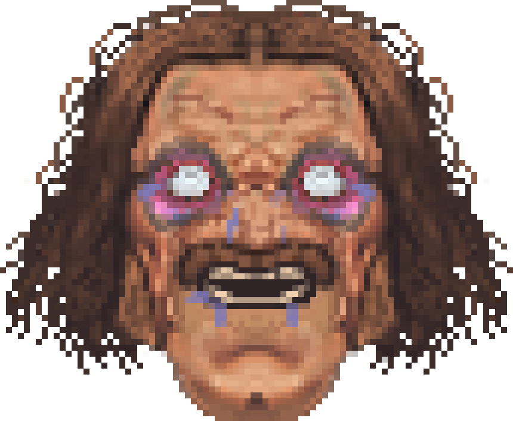

# Cidade dos Anjos 

  

    Oi, meu nome é Rafael. Este é um projeto pessoal inspirado em uma história em quadrinhos que estou escrevendo e ilustrando. Planejo lançá-lo algum dia. A inspiração para este projeto veio do fascinante jogo Cookie Clicker 🍪, criado por Orteil.  
    Aos meus 10 anos, fui cativado pela mecânica e pelas artes dele, e me pegava pensando, e se eu criasse meu próprio "Cookie Clicker".  
    Por circunstâncias inesperadas, acabei me tornando um estudante de ciência da computação aos 18 anos e agora aos 20 anos queria me desafiar a tornar real aquela ideia antiga. Obviamente que não pretendo simplesmente copiar o trabalho de Orteil com uma nova roupagem.
  

  

    
  

## Como Rodar o Projeto

  

    
  

  

  

  

    Como é um projeto feito apenas com Javascript, HTML e CSS puro, basta clonar o repositório e executar o arquivo index.html.  
    <strong>Estou disponibilizando o projeto para que as pessoas possam ver o processo de desenvolvimento e entender o funcionamento do código e a lógica por trás dele. No entanto, vale ressaltar que qualquer pessoa com habilidades básicas de programação pode obter o código-fonte facilmente através de web scraping se o site for ao ar.</strong>  
    <strong>Além disso, gostaria muito de receber feedback sobre o projeto e seria ótimo se você pudesse deixar algumas estrelas aqui no GitHub!</strong>
  

## Ideias para o projeto

  

    
      1. Implementar a navegação pelo mapa da cidade 
      2. Implementar as interações com estruturas da cidade 
      3. Implementar a mecânica de seguidores da sua gangue 
      4. Modificar a UI/UX da página principal, corrigindo principalmente os botões de Save e Import 
      5. Otimizar o código e incluir mais observadores, fortalecer o uso de orientação a objetos 
      6. Implementar criptografia no save do jogo 
    
  

  

    
  

# Obrigado a todos que gostaram do projeto! Se puderem deixar sua estrela e seguir o projeto, seria ótimo!

    

